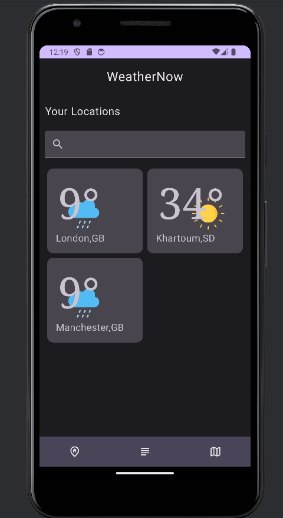
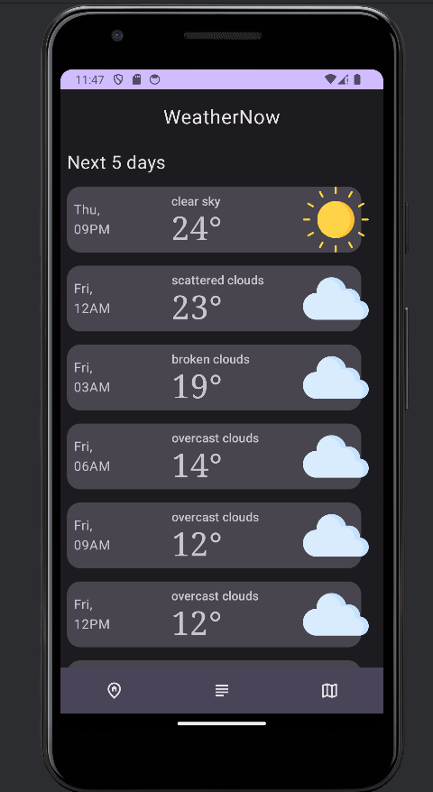
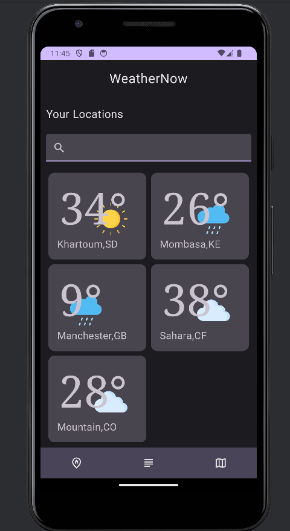

# Weather app

## Set up

in the `local.properties` file, add:

```markdown
API_KEY = openweather api key
```

get openweather API-KEY from [openweathermap.org/api](https://openweathermap.org/api)

## Technologies used

The application is written with [Kotlin](https://kotlinlang.org/)

[Jetpack Compose](https://developer.android.com/jetpack/compose) is a modern UI toolkit for building native Android apps developed by Google.

[Retrofit](https://square.github.io/retrofit/) is a type-safe HTTP client library for Android (and Java) developed by Square. It simplifies the process of making network requests in your Android apps by abstracting away the details of the HTTP protocol and providing a high-level interface to interact with RESTful APIs.

[Room](https://developer.android.com/jetpack/androidx/releases/room) is a persistence library provided by Google's Android Jetpack suite that makes it easier to work with SQLite databases on Android.

## Screenshots






